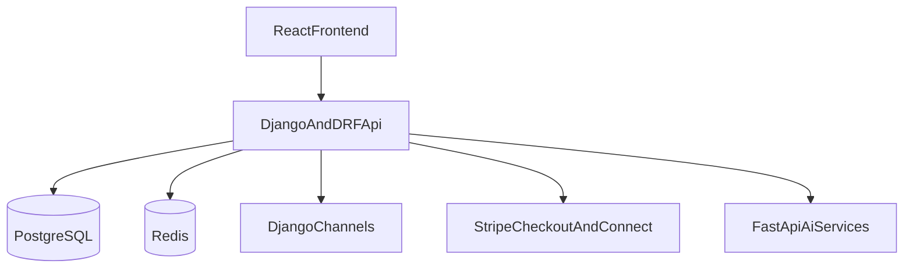
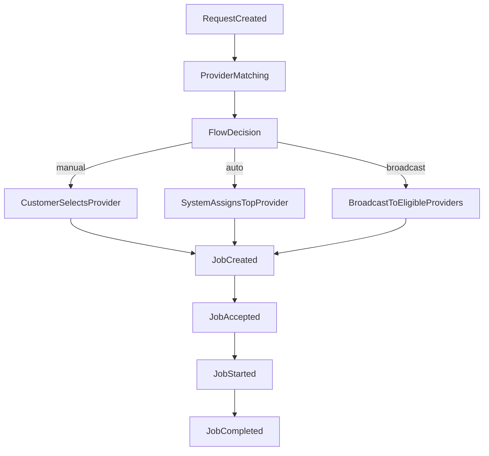
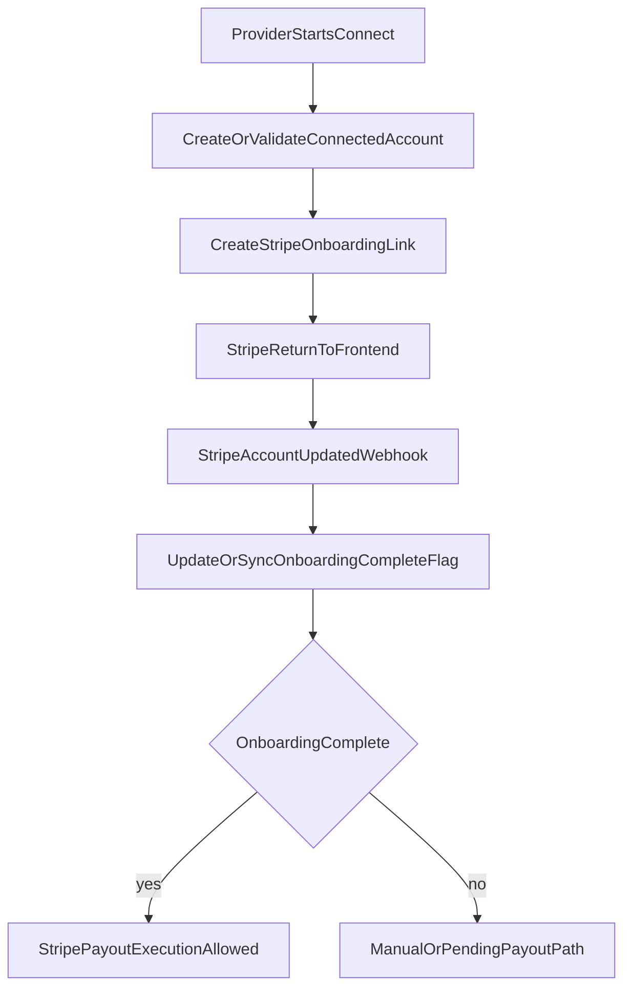
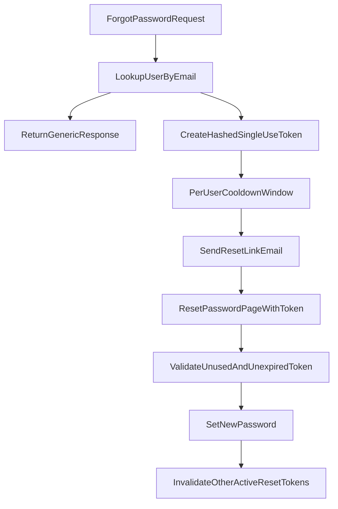

# ServeFlow AI Platform Guide

This guide explains ServeFlow in two layers:
- **Non-technical**: what the platform does and how people use it.
- **Technical**: how the system is built, what services interact, and how critical flows are secured.

---

## Non-Technical Overview

### What problem ServeFlow solves
ServeFlow helps customers quickly find trusted service providers, while helping providers receive reliable work and transparent payouts.

Key outcomes:
- Faster request creation (manual, chatbot, visual scan).
- Better provider selection and dispatch.
- Clear job progress with live updates.
- Structured payments and provider earnings visibility.

### Who uses ServeFlow
- **Customer**: creates requests, tracks progress, pays invoices, chats with providers.
- **Provider**: receives assignments, delivers jobs, monitors wallet, requests payouts.
- **Worker**: optional field role used for operational assignment and location pings.
- **Admin**: configures system settings, oversees quality/safety, reviews audits and operations.

### End-to-end customer and provider journey

```mermaid
flowchart LR
  customer[Customer] --> requestCreate[CreateRequest]
  requestCreate --> dispatch[DispatchModeManualAutoBroadcast]
  dispatch --> provider[ProviderAcceptsJob]
  provider --> work[WorkInProgress]
  work --> complete[JobCompleted]
  complete --> pay[InvoicePayment]
  pay --> earnings[ProviderWalletUpdated]
  earnings --> payout[PayoutToBankWhenEligible]
```

### Money movement in plain language
- Customer pays through Stripe.
- Platform confirms payment and records provider earnings.
- Provider wallet reflects available earnings.
- Provider requests withdrawal.
- If Stripe Connect onboarding is complete, payout is sent to provider bank account.

---

## Technical Overview

### System component map

### Core backend domains
- **Auth and identity**: user registration/login, email verification, password reset.
- **Request and matching**: intake from manual/chatbot/visual paths, recommendations, dispatch decisions.
- **Execution lifecycle**: request and job status transitions with authorization checks.
- **Finance**: invoices, ledger entries, escrow/release, payout requests, Stripe reconciliation.
- **Realtime and notifications**: in-app feed + websocket updates + message threads.
- **Trust and compliance**: provider verification bundles/cases and audit logs.

### Canonical request-to-job flow

### Stripe Connect onboarding and payout eligibility flow

### Forgot-password and reset security flow

Security properties in this flow:
- Account enumeration resistance through generic responses.
- Token stored as hash, not plaintext.
- Token expiry enforced.
- Token single-use enforced.
- Additional short cooldown to reduce abuse.

### Data and accounting model used in payouts
- `Provider.stripe_connect_account_id`: connected account reference.
- `Provider.stripe_connect_onboarding_complete`: payout eligibility gate.
- `ProviderLedgerEntry`: wallet accounting entries (`earned`, `release`, `payout`, etc).
- `ProviderPayout`: payout request lifecycle (`pending`, `processing`, `paid`, `failed`, `cancelled`).

Available balance principle:
- `available_balance = sum(earned) - sum(payout)`

---

## What is currently used in this system

### Frontend
- React application for customer, provider, and admin experiences.
- API integration through axios client.
- Dashboard flows for requests, jobs, notifications, wallet, payouts.

### Backend
- Django + DRF API for core business flows.
- Django Channels for realtime updates.
- Celery-style async task hooks for background processing.

### External services
- Stripe Checkout for customer payments.
- Stripe Connect for provider onboarding and payouts.
- AI microservices for chatbot intent and visual analysis.

### Infrastructure
- PostgreSQL for persistent business data.
- Redis for realtime/cache/broker style workloads.
- Environment-driven configuration for security-sensitive keys.

---

## Operational checks and troubleshooting

### Connect troubleshooting
- Verify Stripe mode and account context (test vs live).
- Confirm persisted `stripe_connect_account_id` belongs to current Stripe context.
- Confirm webhook delivery for `account.updated`.
- Use status reconciliation path when webhook delivery is delayed.

### Forgot-password troubleshooting
- Confirm `FRONTEND_URL` is configured and valid.
- Verify email backend/system SMTP settings.
- Ensure public reset endpoints are not blocked by stale auth token injection.
- Validate password reset token rows are being created and expiring correctly.

### Realtime and notifications
- If websocket is unavailable, use notification feed fallback.
- Confirm auth token validity and channels route access.

---

## Why this architecture is practical
- Keeps product flows understandable for users while preserving robust backend controls.
- Separates core business APIs, AI augmentation, realtime events, and payment rails.
- Uses auditable ledger and payout records for finance traceability.
- Supports progressive hardening: better monitoring, retries, and operational safeguards over time.

