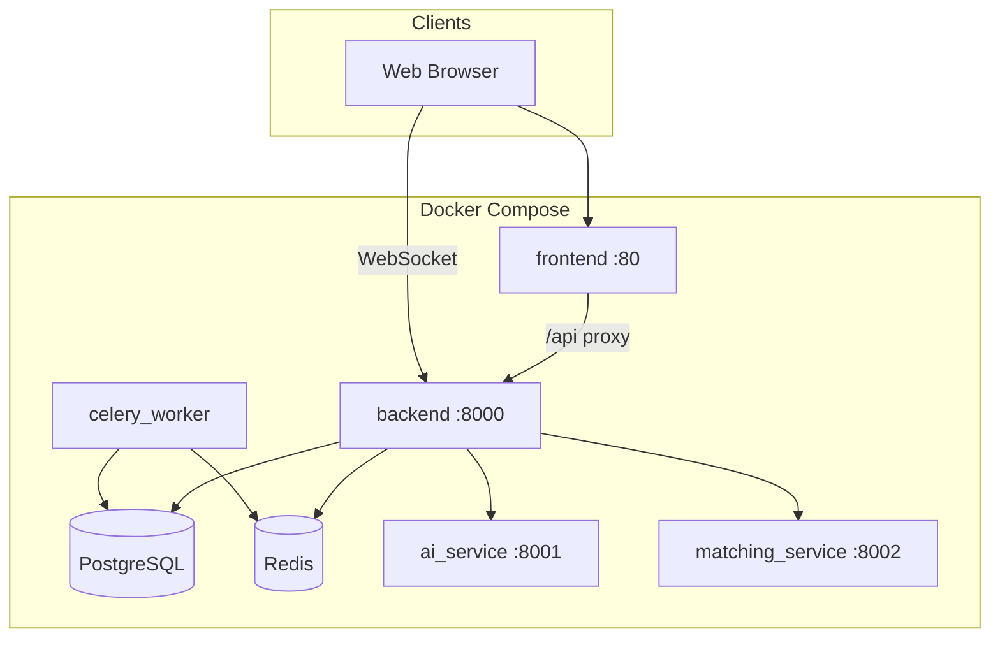
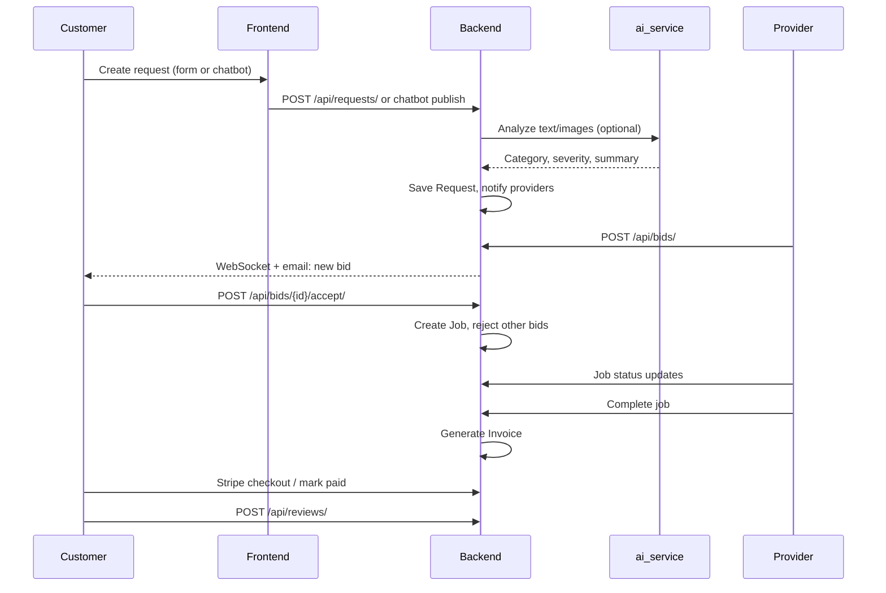
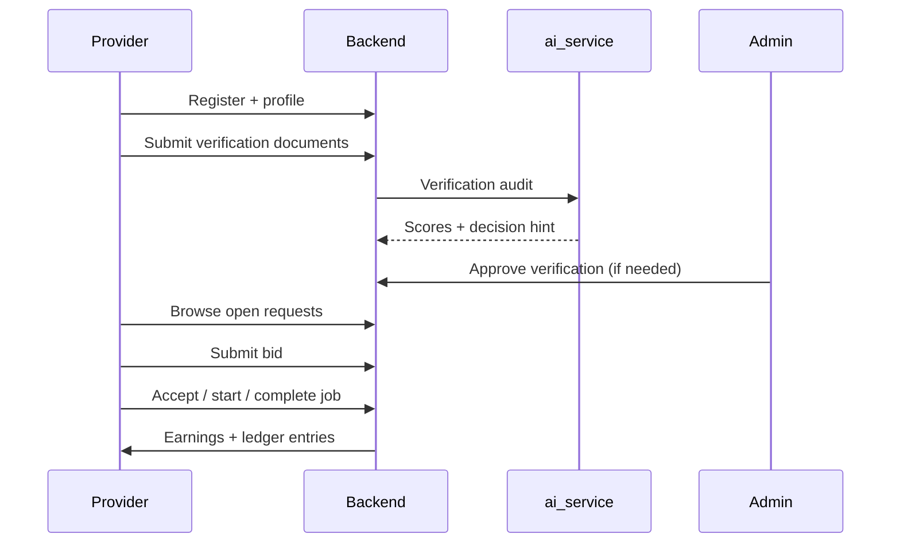
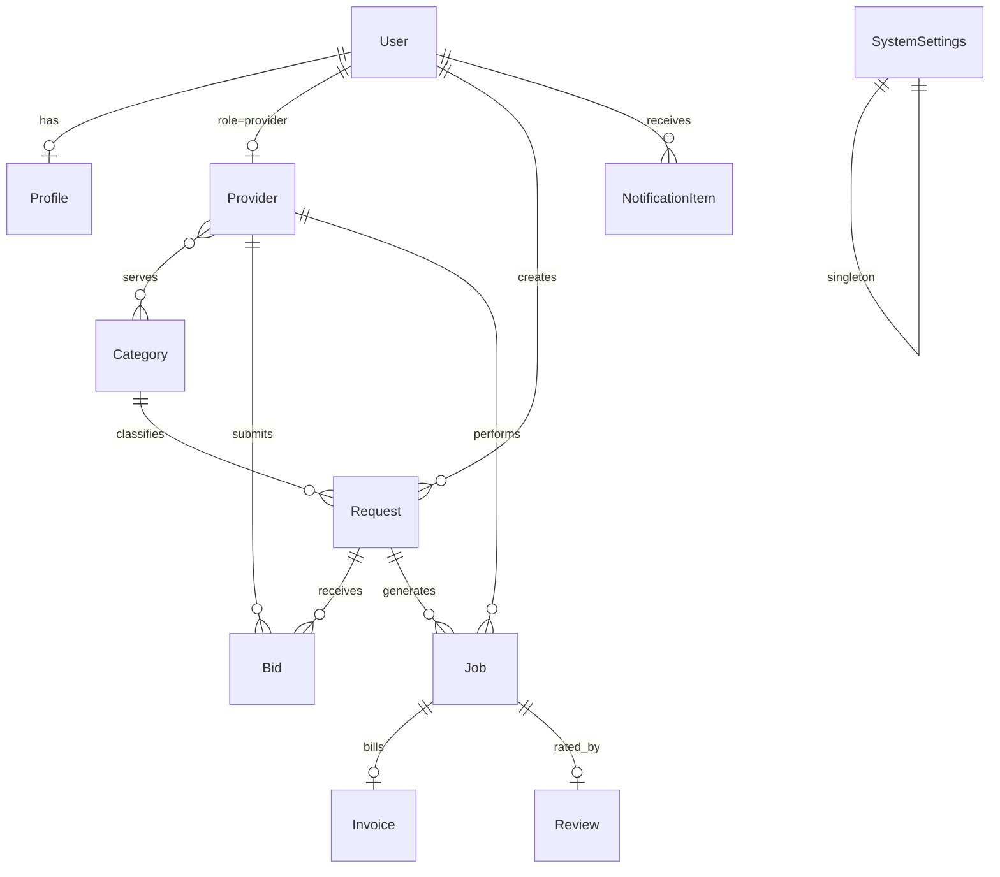

# ServeFlow AI — Platform Documentation

**Version:** 2.0 · **Last updated:** May 2026  
**Audience:** Product owners, testers, developers, and operators

---

## Table of contents

1. [Non-technical overview](#1-non-technical-overview)
2. [User guide](#2-user-guide)
3. [Technical architecture](#3-technical-architecture)
4. [Database schema](#4-database-schema)
5. [API overview](#5-api-overview)
6. [Infrastructure](#6-infrastructure)
7. [Security](#7-security)
8. [Operations](#8-operations)

---

## 1. Non-technical overview

### 1.1 Problem statement

Home and local professional services (plumbing, electrical, cleaning, HVAC, and similar trades) suffer from:

- **Trust gaps** — customers cannot easily verify identity, insurance, or past work quality.
- **Poor matching** — generic directories do not rank providers by skill, distance, availability, or reputation.
- **Fragmented workflow** — quotes, scheduling, payment, and disputes often happen across phone, text, and cash.
- **Slow discovery** — describing a problem accurately enough to get a fair quote takes time.

ServeFlow addresses these by combining a structured marketplace (requests → bids → jobs → invoices) with AI-assisted intake and provider verification.

### 1.2 Solution overview

ServeFlow AI is a **two-sided marketplace**:

| Actor | Capabilities |
|-------|----------------|
| **Customer** | Register, verify email (OTP), create service requests (form or chatbot), compare bids, pay invoices, leave reviews |
| **Provider** | Onboard with documents, browse open requests, submit bids, manage jobs, view earnings |
| **Admin** | Verify providers, configure commission and AI keys, audit activity, resolve disputes |

Core differentiators:

- **AI request analysis** — categorization, severity, duration, and visual damage hints from text and images.
- **Smart matching** — scoring by category fit, distance, rating, and availability (`matching_service`).
- **End-to-end job flow** — bid acceptance creates a job; completion generates an invoice; Stripe handles payment where configured.
- **Real-time updates** — WebSocket notifications for bids, jobs, and system events.

---

## 2. User guide

### 2.1 Registration and login

1. Open **http://localhost** (Docker) or your deployed URL.
2. Choose **Customer** or **Provider** on the auth screen.
3. Register with email, username, and password.
4. If email OTP is enabled, check your inbox for a one-time code and verify before full access.
5. Login accepts **email or username** plus password.

**Demo accounts** (after `seed_serveflow_v2`): see README — e.g. `customer1` / `user12345`, `pro_plumber` / `user12345`, `admin` / `admin123`.

### 2.2 Creating a service request

**Visual / form flow**

1. Customer dashboard → **New request**.
2. Enter title, description, address (map pin optional), budget, preferred date.
3. Upload photos of the issue (optional but improves AI analysis).
4. Submit — backend may call **AI analysis** to suggest category and severity.
5. Request becomes visible to matched providers (broadcast / open for bids).

**Chatbot flow**

1. Start **chatbot** intake from the create-request UI.
2. Describe the problem in natural language; the bot collects missing fields (location, urgency, images).
3. Review the **draft snapshot** before publishing.
4. **Publish** creates the formal `Request` record and triggers provider notifications.

### 2.3 Bids and job assignment

1. Providers see open requests in their **Browse** / opportunities list.
2. Provider submits a **bid**: amount, proposal text, estimated duration.
3. Customer receives notification (WebSocket + email when SMTP is configured).
4. Customer **accepts** one bid — others are rejected; a **Job** is created linking request and provider.
5. Provider progresses job: **Accept → Start → Complete** (status tracked in UI and `JobStatusHistory`).

### 2.4 Invoices and payments

1. On job completion, an **Invoice** is generated (subtotal, tax, commission per `SystemSettings`).
2. Customer pays via **Stripe Checkout** when keys are configured in admin / `credentials.txt`.
3. Admin can mark invoices paid manually in edge cases.
4. Provider **earnings** and ledger entries reflect platform commission.

### 2.5 Reviews

1. After job **completed**, customer can submit a **Review** (1–5 stars + comment).
2. Provider **rating** and `completed_jobs` are updated from aggregated reviews.

### 2.6 Settings

- **Profile** — name, phone, address, photo, bio.
- **Notifications** — in-app feed; WebSocket toasts for live events.
- **Security** — password change; email verification link flow where enabled.

### 2.7 Provider onboarding

1. Register as **Provider**.
2. Complete profile: categories, skills, service area (coordinates on profile).
3. **Verification bundle** — upload ID front/back, selfie with ID, optional certificate and portfolio images.
4. AI-assisted verification (`ai_service`) produces scores; admin may approve from verification queue.
5. Once **verified**, provider can bid on requests (if `require_provider_verification` is on).

---

## 3. Technical architecture

### 3.1 System context



### 3.2 Customer journey (request to review)



### 3.3 Provider journey



### 3.4 Component responsibilities

| Component | Technology | Responsibility |
|-----------|------------|----------------|
| `frontend` | React, Vite, nginx | SPA, API proxy, static assets |
| `backend` | Django 5, DRF, Channels, Daphne | REST API, auth, ORM, WebSockets, business rules |
| `ai_service` | FastAPI, Gemini | Request analysis, verification vision, chatbot LLM calls |
| `matching_service` | FastAPI | Provider scoring (affinity, proximity, reputation) |
| `celery_worker` | Celery | Email, long-running tasks |
| `db` | PostgreSQL 15 | Persistent data |
| `redis` | Redis | Channel layer, Celery broker |

---

## 4. Database schema

### 4.1 Entity relationship (core models)



### 4.2 Main models (fields and relationships)

#### User (`users`)

| Field | Notes |
|-------|-------|
| `username`, `email` | Unique email; login by either |
| `role` | `user`, `provider`, `worker`, `admin` |
| `phone`, `is_email_verified` | OTP / verification gate |
| Relations | `profile`, `requests`, `notification_items` |

#### Profile (`profiles`)

One-to-one with `User`: `photo`, `bio`, `address`, `latitude`, `longitude`, `certifications` (JSON).

#### Provider (`providers`)

One-to-one with `User`: `rating`, `completed_jobs`, `total_earnings`, `verified`, `verification_status`, `availability_status`, `skills` (JSON), `categories` (M2M), `onboarding_completed`, Stripe Connect fields.

#### Category (`categories`)

`name`, `pricing_model` (fixed/hourly/quote), `base_price`, `icon`, `image`, `is_active`. Related: `RateCard` (severity bands).

#### Request (`requests`)

| Field | Notes |
|-------|-------|
| `user` | Customer FK |
| `category`, `title`, `description`, `status` | Lifecycle: pending → open_for_bids → assigned → completed |
| `address`, `latitude`, `longitude` | Geocoding / matching |
| `budget`, `preferred_date`, `ai_summary` | JSON from AI |
| `escrow_*` | Stripe escrow fields when enabled |
| Relations | `bids`, `jobs`, images |

#### Bid (`bids`)

`request`, `provider`, `amount`, `proposal`, `estimated_duration`, `status` (pending/accepted/rejected/withdrawn). Unique per (request, provider).

#### Job (`jobs`)

`request`, `provider`, `status` (pending → accepted → started → completed), `commission_rate`, `provider_earnings`, optional `assigned_worker`. Related: `JobStatusHistory`, `Invoice`, `Review`, `Message`.

#### Invoice (`invoices`)

One-to-one with `Job`: `subtotal`, `tax`, `discount`, `total`, address fields, `paid`, Stripe intent/session IDs.

#### Review (`reviews`)

One-to-one with `Job`: `rating` (1–5), `comment`.

#### NotificationItem (`notification_items`)

Per-user: `event_type`, `title`, `message`, `payload` (JSON), `is_read`.

#### SystemSettings (`system_settings`)

Singleton row `id=1`: platform name, commission/tax, SMTP, Gemini keys 1–5, Stripe keys, feature flags (`enable_ai_analysis`, `enable_bidding_system`, `require_provider_verification`, etc.). Populated from env and `credentials.txt` via `sync_credentials_file`.

#### Other notable models

- `EmailOTP`, `EmailVerificationToken`, `PasswordResetToken` — auth flows
- `VerificationBundle`, `VerificationCase` — provider KYC
- `ServiceRequest`, `ProviderMatch` — v2 AI-first request pipeline (parallel to legacy `Request`)
- `AuditLog` — admin audit trail
- `EmailLog` — outbound email diagnostics

---

## 5. API overview

Base URL: **`http://localhost:8000/api/`** (Docker: also proxied via frontend at `/api/`).

Authentication: **Token** header `Authorization: Token <key>` from `POST /api/auth/login/`.

### 5.1 Authentication

| Method | Path | Description |
|--------|------|-------------|
| POST | `/api/auth/login/` | Username/email + password → token |
| POST | `/api/auth/request-otp/` | Request email OTP (existing users) |
| POST | `/api/auth/verify-otp/` | Verify OTP code |
| POST | `/api/users/` | Register (router) |

### 5.2 Requests and chatbot

| Method | Path | Description |
|--------|------|-------------|
| GET/POST | `/api/requests/` | List / create requests |
| POST | `/api/requests/ai-analyze/` | Image + text analysis |
| POST | `/api/requests/create-v2/` | V2 service request create |
| GET | `/api/requests/flow/snapshot/` | Flow state snapshot |
| POST | `/api/chatbot/intent/` | Chatbot NLU step |
| POST | `/api/chatbot/publish/` | Publish chatbot draft to request |

### 5.3 Bids, jobs, invoices, reviews

| Resource | Router prefix | Key actions |
|----------|---------------|-------------|
| Bids | `/api/bids/` | create, accept, reject |
| Jobs | `/api/jobs/` | accept, start, complete |
| Invoices | `/api/invoices/` | list, mark_paid, Stripe checkout |
| Reviews | `/api/reviews/` | create (requires completed job) |

### 5.4 Payments (Stripe)

| Method | Path | Description |
|--------|------|-------------|
| POST | `/api/payments/stripe-checkout/` | Create checkout session |
| POST | `/api/stripe/webhook/` | Stripe webhooks |
| POST | `/api/payments/stripe-confirm/` | Confirm payment client-side |
| GET | `/api/payments/stripe-status/` | Payment status |

Keys live in `SystemSettings` (`stripe_public_key`, `stripe_secret_key`, `stripe_webhook_secret`).

### 5.5 WebSocket

`ws://localhost:8000/ws/notifications/?token=<AUTH_TOKEN>`

Used for live bid, job, and notification events. Production should use `wss://` and Redis channel layer.

See **[API_DOCS.md](API_DOCS.md)** for extended endpoint list.

---

## 6. Infrastructure

### 6.1 Docker Compose services

| Service | Image/build | Ports | Depends on |
|---------|-------------|-------|------------|
| `db` | postgres:15-alpine | 5432 | — |
| `redis` | redis:alpine | 6379 | — |
| `backend` | `./backend` | 8000 | db, redis (healthy) |
| `frontend` | `./frontend` | 80 | backend (healthy) |
| `ai_service` | `./ai_service` | 8001 | backend (healthy) |
| `matching_service` | `./matching_service` | 8002 | — |
| `celery_worker` | `./backend` | — | db, redis |

Backend healthcheck: `GET /health/` on port 8000 inside container.

### 6.2 Email (SMTP)

- Configured via **Admin → System Settings** or **`credentials.txt`** → `sync_credentials_file`.
- Templates under `backend/api/templates/emails/` (HTML + text): OTP, bids, job status, invoices, password reset.
- **Celery** sends async mail when not in eager mode; Docker dev uses `CELERY_TASK_ALWAYS_EAGER=true`.
- Failures logged in **`EmailLog`** model (Django admin).

### 6.3 WebSockets

- **Django Channels** with **Daphne** ASGI server.
- **Redis** channel layer when `REDIS_URL` is set (default in compose).
- Token passed as query param for connection auth.

### 6.4 Celery

- App: `serveflow.celery`
- Worker service: `celery_worker`
- Tasks: email, notifications, background processing (`backend/api/tasks.py`)

### 6.5 Environment variables reference

| Variable | Used by | Purpose |
|----------|---------|---------|
| `SECRET_KEY` | backend | Django secret |
| `DEBUG` | backend | Debug mode (1/0) |
| `ALLOWED_HOSTS` | backend | Host allowlist |
| `DATABASE_URL` | backend, celery | Postgres connection |
| `REDIS_URL` | backend, celery | Channels + Celery |
| `CORS_ALLOWED_ORIGINS` | backend | Browser origins |
| `FRONTEND_URL` | backend | Links in emails |
| `AI_SERVICE_URL` | backend | Internal AI base URL |
| `AI_SERVICE_INTERNAL_TOKEN` | backend, ai_service | Service-to-service auth |
| `MATCHING_SERVICE_URL` | backend | Matching service URL |
| `GEMINI_API_KEY` | ai_service | Optional single key |
| `ENABLE_EMAIL_OTP` | backend | OTP login/verify |
| `CELERY_TASK_ALWAYS_EAGER` | backend | Sync tasks in dev |
| `CREDENTIALS_FILE` | backend | Override credentials path |
| `SYNC_SETTINGS_FROM_ENV_FORCE` | backend | Overwrite SystemSettings from env |
| `STRIPE_*` | backend | Payment keys (or credentials file) |
| `SMTP_*` / `EMAIL_*` | backend | Email (or credentials file) |

Docker Compose sets sensible defaults in `docker-compose.yml`. See also `.env.example` and **[INFRASTRUCTURE.md](INFRASTRUCTURE.md)**.

---

## 7. Security

### 7.1 Authentication

- **DRF Token** authentication for REST.
- Passwords hashed (Django defaults).
- **Email OTP** optional (`ENABLE_EMAIL_OTP`); OTP stored hashed in `EmailOTP`.
- Email verification and password reset tokens stored hashed with expiry.

### 7.2 Rate limiting

Scoped throttles in `auth_security.py`:

- **IP-based** — `ScopedIPRateThrottle` on sensitive views (login, OTP request).
- **Email-based** — `ScopedEmailRateThrottle` limits abuse per email address.

Configure rates via DRF throttle settings in `settings.py`.

### 7.3 Other controls

- **CORS** restricted to configured origins.
- **CSRF** on session views; API uses token auth.
- **Internal token** between backend and `ai_service`.
- **Provider verification** gate before bidding (configurable).
- **Audit logs** for admin accountability.

Production checklist: `DEBUG=False`, strong `SECRET_KEY`, HTTPS, secure cookies, Redis for channels, secrets in env not in git.

---

## 8. Operations

### 8.1 New device setup (Windows)

1. Install Docker Desktop.
2. Clone repository.
3. Add `credentials.txt` (optional).
4. Run **`setup-and-run.bat`** from repo root.
5. Open http://localhost

Skip seed: `setup-and-run.bat --no-seed`

### 8.2 `credentials.txt` format

Place at **repository root**. Example structure (use your real values; brackets required for parsed fields):

```text
---------------STRIPE PUBLISHABLE-----------------------------
[pk_test_xxxxxxxx]

----------------------STRIPE SECRET--------------------------
[sk_test_xxxxxxxx]

----------------SMTP CREDENTIALS-------------------------
Username = [your-smtp-user@gmail.com]
Password = [your-app-password]
Port = 587
SMTP HOST = [smtp.gmail.com]

---------------------GEMINI API KEYS----------------------------------
API_KEY_1 = your-gemini-key-1
API_KEY_2 = your-gemini-key-2
```

Parsed fields map to `SystemSettings`: `stripe_public_key`, `stripe_secret_key`, `smtp_*`, `from_email`, `gemini_api_key_1` … `_5`.

Commands:

```bat
docker compose exec backend python manage.py sync_credentials_file --force
```

### 8.3 Migrations

```bat
docker compose exec backend python manage.py migrate --noinput
```

Create new migrations after model changes:

```bat
docker compose exec backend python manage.py makemigrations
```

### 8.4 Seed command

```bat
docker compose exec backend python manage.py seed_serveflow_v2
```

Idempotent-ish: uses `get_or_create` for users/categories; creates sample requests, bids, jobs, and reviews. Safe for local QA; avoid on production databases with real data.

### 8.5 Rebuild and reset

```bat
docker compose down
docker compose build --no-cache
docker compose up -d
```

Full data reset (destructive):

```bat
docker compose down -v
docker compose up -d
docker compose exec backend python manage.py migrate --noinput
docker compose exec backend python manage.py seed_serveflow_v2
```

### 8.6 Logs and health

```bat
docker compose ps
docker compose logs backend --tail 100
curl http://localhost:8000/health/
```

### 8.7 Generating this document as Word

```bat
pip install python-docx
python docs/generate_docx.py
```

Output: `docs/ServeFlow-Documentation.docx`

---

*ServeFlow AI — MIT License*
