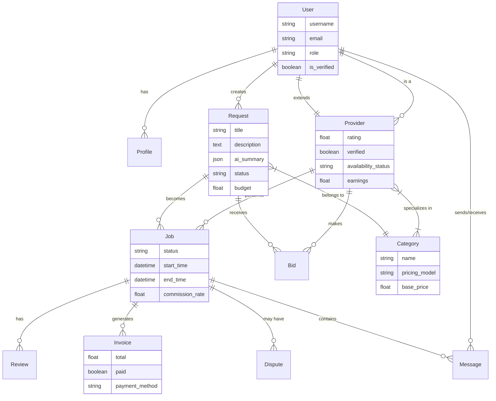
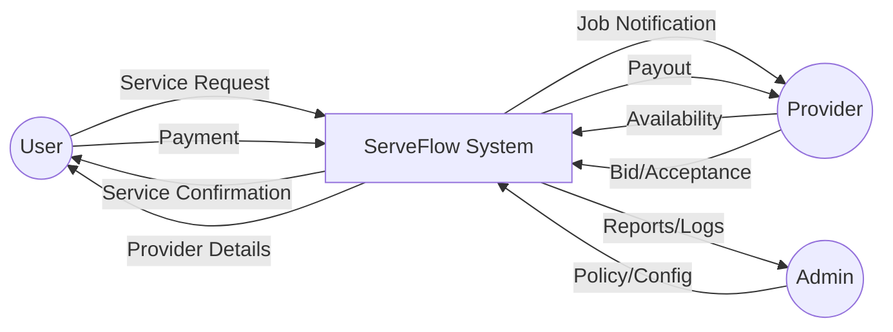
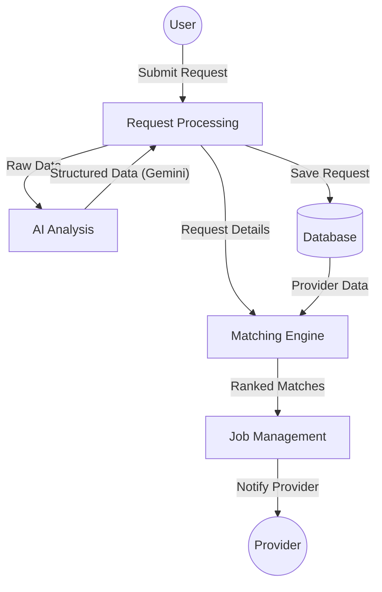
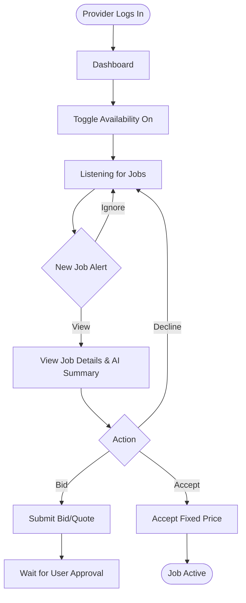

# Technical Documentation: ServeFlow AI

## 1. System Architecture
High-level overview of the ServeFlow microservices architecture.

```mermaid
graph TD
    UserClient[User Client (React)]
    ProviderClient[Provider Client (React)]
    AdminClient[Admin Client (React)]
    
    LB[Load Balancer / Nginx]
    
    subgraph "Backend Cluster"
        Django[Django Core API]
        FastAPI_AI[FastAPI AI Service]
        FastAPI_Match[FastAPI Matching Service]
        Redis[Redis Cache & Queue]
    end
    
    subgraph "Data Layer"
        PostgreSQL[(PostgreSQL Database)]
        GoogleGemini[Google Gemini API]
    end

    UserClient --> LB
    ProviderClient --> LB
    AdminClient --> LB
    
    LB --> Django
    
    Django --> PostgreSQL
    Django --> Redis
    Django -- "Async Task" --> FastAPI_AI
    Django -- "Async Task" --> FastAPI_Match
    
    FastAPI_AI --> GoogleGemini
    FastAPI_Match --> Django
    FastAPI_Match --> Redis
```

## 2. Entity Relationship Diagram (ERD)
Detailed schema of the relational database.



## 3. Data Flow Diagrams (DFD)

### Level 0 DFD (Context Diagram)


### Level 1 DFD (Request Processing)


## 4. User Flow Charts

### User Request Flow
```mermaid
flowchart TD
    Start([User Logs In]) --> Dashboard
    Dashboard --> CreateReq[Click 'New Request']
    CreateReq --> InputDetails[Enter Title, Desc, Address]
    InputDetails --> UploadImg[Upload Image (Optional)]
    UploadImg --> Submit
    
    Submit --> AI{AI Analysis}
    AI -- Processing --> Loading[Show Skeleton Loader]
    AI -- Success --> Summary[Show AI Summary & Key Points]
    
    Summary --> Confirm{Confirm Request?}
    Confirm -- No --> Edit[Edit Details]
    Confirm -- Yes --> Post[Post to Marketplace]
    
    Post --> Wait[Waiting for Bids/Match]
    Wait --> MatchFound[Provider Found]
    MatchFound --> Accept[Accept Provider]
    Accept --> Payment[Hold Payment]
    Payment --> JobStart([Job Started])
```

### Provider Job Flow


## 5. Navigation Structure (Sitemap)
Visual representation of the application's routing.

```mermaid
graph TD
    Root[/] --> Landing[Landing Page]
    Root --> Auth[Authentication]
    
    Auth --> Login
    Auth --> Register
    
    Root --> Dashboard[User Dashboard]
    Dashboard --> MyReq[My Requests]
    Dashboard --> Settings
    Dashboard --> Tracking[Live Tracking]
    
    Root --> ProvDash[Provider Dashboard]
    ProvDash --> Jobs[Job Queue]
    ProvDash --> Earnings
    ProvDash --> Profile
    
    Root --> Admin[Admin Panel]
    Admin --> Users
    Admin --> Categories
    Admin --> Analytics
    Admin --> AuditLogs
```
