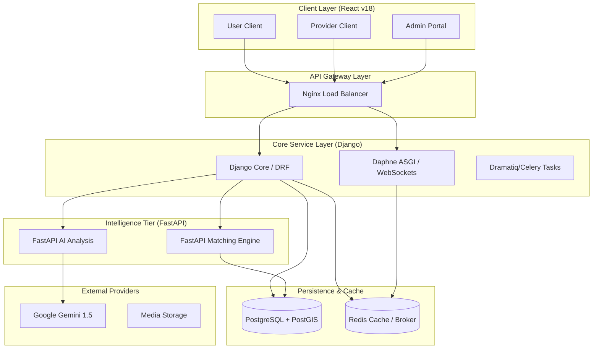
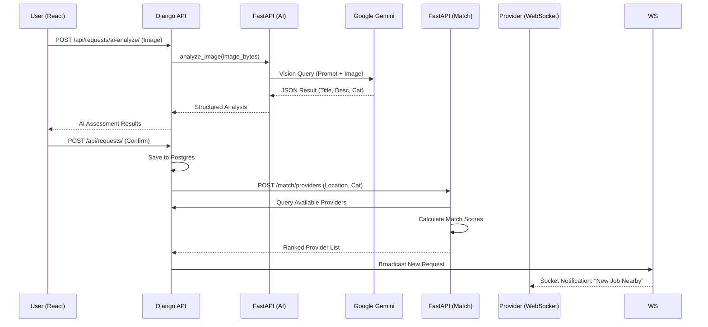
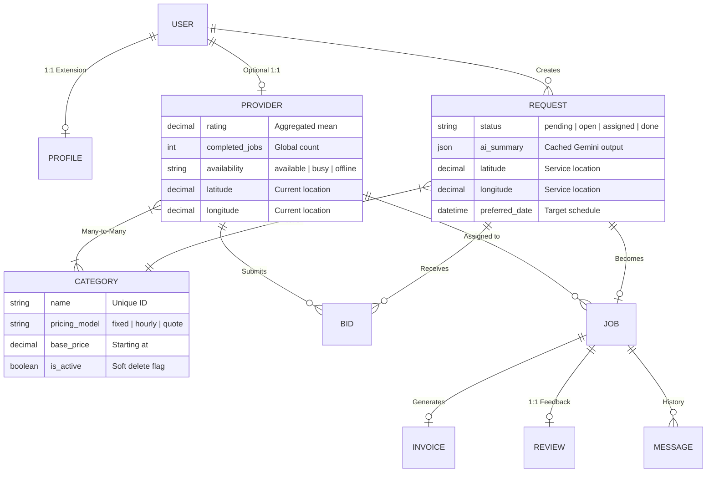
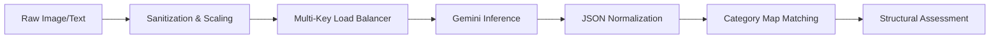
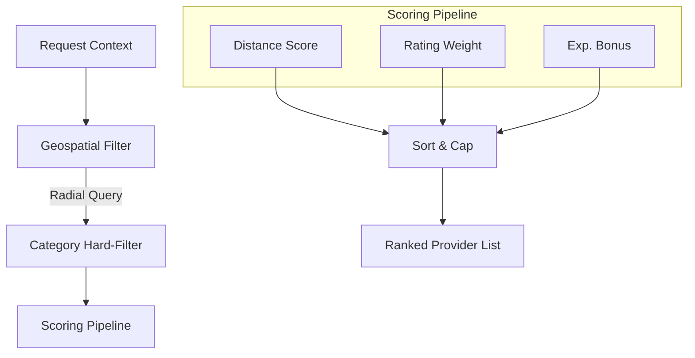

# Technical Documentation: ServeFlow AI

## 1. System Architecture
ServeFlow AI utilizes a distributed microservices architecture designed for high throughput and fault tolerance.

---

## 2. Sequence Diagram: Service Request Protocol
This diagram illustrates the lifecycle of a request from initial visual scan to provider notification.

---

## 3. Data Model (Detailed ERD)
The schema is optimized for geospatial proximity and historical performance tracking.

---

## 4. Logical Data Flow (Level 2)

### 4.1 AI Analysis Module (Process 2.0)

### 4.2 Matching Engine Module (Process 3.0)

---

## 5. Network & Infrastructure
*   **Protocol Support**: HTTP/1.1 for REST, WSS for real-time tracking.
*   **Media Storage**: Local storage (Dev) or S3-compatible (Prod) for user-uploaded site photos.
*   **Inter-Service Auth**: Internal HMAC or Shared Secret for FastAPI <-> Django communication.
